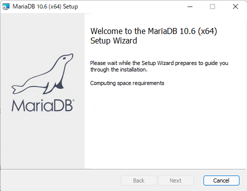
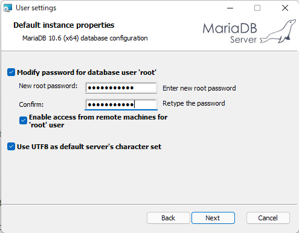
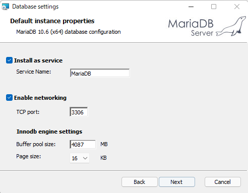
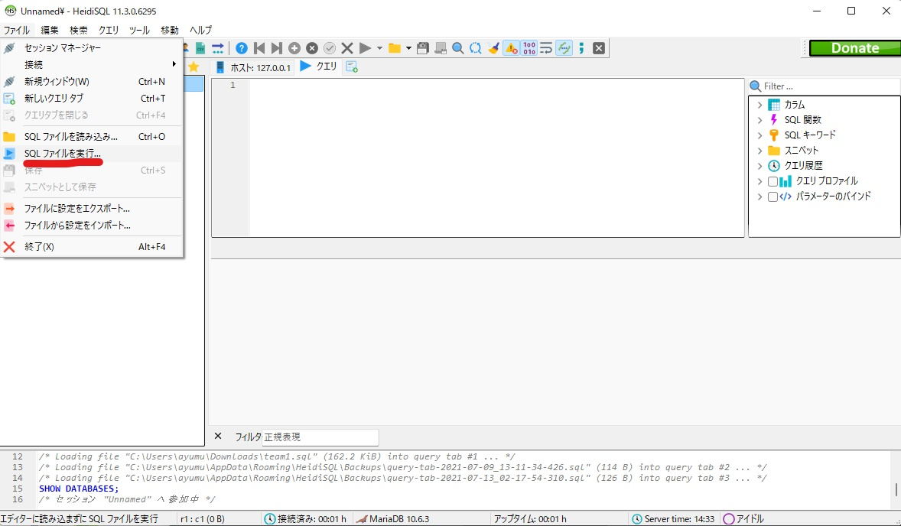
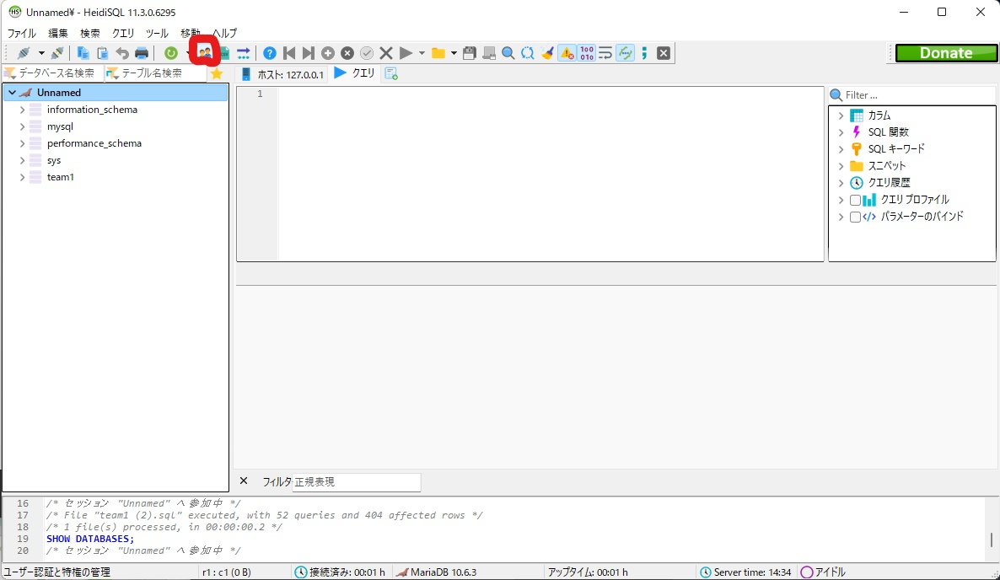
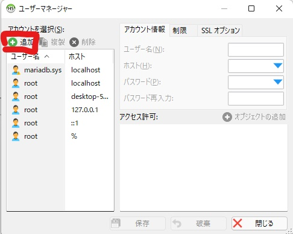
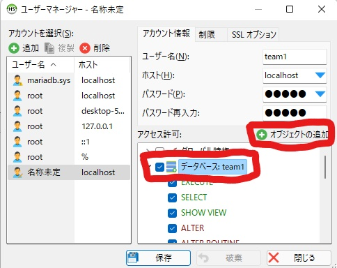

## MariaDBのインストール手順

### 1. MariaDBを公式サイトからダウンロートする
[MariaDB](https://downloads.mariadb.org/mariadb/+releases/)公式サイトにある最新のStable版を選択し自分のシステムに合うバージョンをインストールします。
### 2. MariaDBのインストーラーに従ってインストールを行う
  
### ここですべてのチェックボックスにチェックを入れてroot権限用のパスワードを登録します。  

  
### ここでMariaDBのインストールは終了です
### 次にサーバのデータを登録します
今回はデモデータ`./data/team1.sql`をデータベースに登録します。手順は次のとおりです。
画像にあるようにSQLファイルを実行を選択し、team1.sqlを実行します。

### 次にデータベースへのアクセスを認めるためにアクセス権限の設定を行います。

### 個々にあるユーザ名とパスワードは[db.json](./Server/DB/db.json)に定義したある値を入力してください。

これでデータベースの設定は完了です。