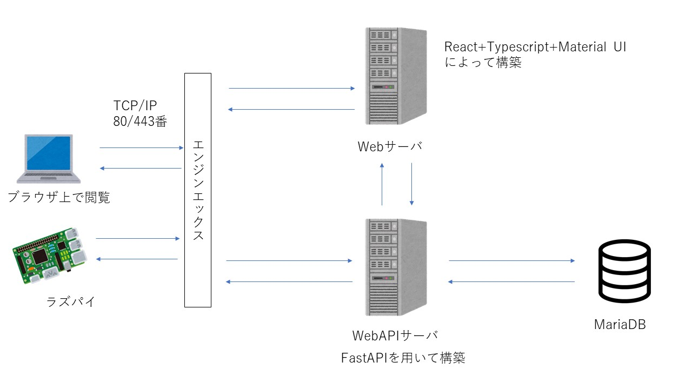

# 出席管理システム(Team1)

- [出席管理システム(Team1)](#出席管理システムteam1)
  - [システム創生プロジェクト実習2](#システム創生プロジェクト実習2)
  - [システムの概要](#システムの概要)
  - [システムの起動(本番環境)](#システムの起動本番環境)
  - [開発段階のシステムの起動](#開発段階のシステムの起動)
  - [システム開発について](#システム開発について)
  - [データベースの構成について](#データベースの構成について)
  - [ライセンス](#ライセンス)
___
## システム創生プロジェクト実習2
このリポジトリはシステム創生プロジェクト実習2の課題として開発行っています。  
したがって、現在はチームメンバーのみの利用に限定させていただきます。
## システムの概要
現在のシステム全体  


## システムの起動(本番環境)
このシステムではインストールや起動を簡潔に実行できるようにしています。  
>1. システムのインストール
   - [MariaDB](https://downloads.mariadb.org/mariadb/+releases/)からダウンロードしインストールを行ってください。詳しいインストール手順は、[MariaDB_install.md](./MariaDB_install.md)を確認してください。
   - install.bat を実行します。
>2. nginxのインストール
   - nginx_install.bat を実行します。
>3. システムの起動
   - start.bat を実行します。
   - アクセス先URLは `http://(コンピュータのIPアドレス)/` です。
   - 起動したあと**ログインユーザ名(学籍番号または教員番号)とパスワードを登録してください。登録方法は`http://localhost:8000/docs`にアクセスした後に`/user/create`を選択し、ユーザ名とパスワードを登録してください。**
   - 実運用する際はSSL証明書を取得し、httpsで通信するようにしてください。設定ファイルは`nginx/setting/team1.conf`にあります。
>4. システムの停止
   - 開いている`powershell`ウィンドウをControl+Cを使って停止します。
   - stop.bat を実行し、nginxを停止します。
## 開発段階のシステムの起動
- Webページの起動
  ```powershell
  cd Client
  npm install
  npm run build
  npm start
  ```
- サーバの起動方法
  ```powershell
  cd Server
  pip install -r requirements.txt
  uvicorn main:app
  ```
  サーバーが起動できないときはMariaDBがインストールされていることを確認してください。  
  また、アクセス権限を[db.json](./Server/DB/db.json)に設定した値と同じか確かめてください。
## システム開発について
* 開発する機能については順次[Project](https://github.com/stuayu/team1/projects)のToDoリストに記載し，必要があれば機能に応じて[Issue](https://github.com/stuayu/team1/issues)で議論を行う．
* 開発の流れとしては，まずはサーバーをチームメンバーで完成させる．その後，ウェブによるGUIの作成とラズパイでカードの読み取り，出欠確認の機能の実装を進める．
- Pythonライブラリについて
  - Pythonこのシステムで利用するライブラリは[requirements.txt](./requirements.txt)に記載してください．
  - [requirements.txt](./requirements.txt)に記載したライブラリをPCにインストールするときは以下のコマンドを実行してください．必要なライブラリがすべてインストールされます．
    ```powershell
    pip install -r requirements.txt
    ```
___
## データベースの構成について

- **student**：学籍番号、名前、ふりがな、性別、IDmのカラムがありそれぞれにデータを入れておきます。
- **student_all**：上のstudentのデータに追加して講義IDのカラムを追加しています。
- **student_attend**：回数、講義ID、学籍番号、名前、出欠のカラムがあります。ここのデータは自動で追加されます。
- **subject_rules**：講義ID、科目名、ID、教員名、開始時間、終了時間、出席限度(分)、遅刻限度(分)、試験、履修者数のカラムがある。
- **subject_rules2**：日付、時間割、回数のカラムがあります。日付はExcelの表示形式に準拠しており、例)2021/1/20のように入力します。  
                      時間割はtime_rulesの値を入力します。回数は講義回数を入力してください。
- **teacher_subject**：ID、氏名、ふりがな、性別、担当科目1、ID1、担当科目2、ID2のカラムがあります。IDは教員IDであり、  
                      担当科目とIDは連携しています。
- **time_rules**: 講義ID、時間割、受付開始、出席限度、遅刻限度、試験、教員ID、教員名のカラムがあります。
- **user**: id、name、password、refresh_tokenのカラムがある。
## ライセンス
[MIT License](./LICENSE)でライセンスしています。
